
intro-anato-simul:IHC-conclu

# Sound Localization Basics
auth: Paolo Marzolo
adv:  Francesco De Santis

---
# Table of contents

1. introduction
    - task definition
    - why it's interesting
    - basic concepts
1. anatomical 
    - overall structure
    - my part

3. simulation
    - nest and architecture
    - brian2-brian2hears
    - my implementation and workflow
4. conclusion

---
# Introduction
- double presentation
- objectives:
    - familiarize audience with the subjects
    - present what i've been working on
    - get some more presentation practice
- feedback welcome!

---
## Task definition
> The ability to identify the location of a sound source in a sound field. (Jutras et al., 2020)

### humans
- report verbally (Wightman and Kistler, 1992)

---

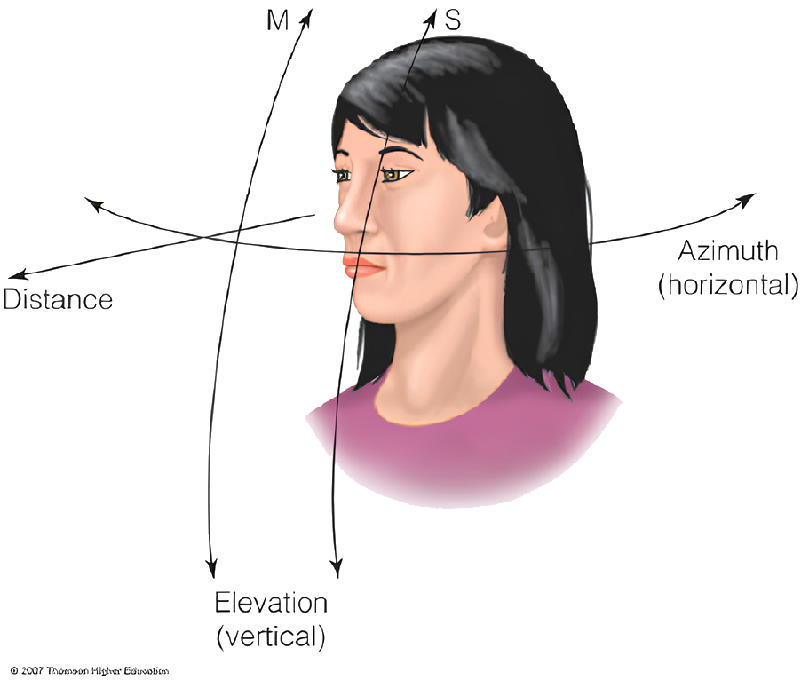

> a subject might call out the coordinates "minus 45, 30," indicating that the sound came from 45° to the left of the subject and from 30° above the horizontal plane.
\
(Wightman and Kistler, 1992)

---
## Task definition
> The ability to identify the location of a sound source in a sound field. (Jutras et al., 2020)

### humans
- report verbally (Wightman and Kistler, 1992)
- nose pointing (Makous and Middlebrooks, 1990)

---
## Task definition
> The ability to identify the location of a sound source in a sound field. (Jutras et al., 2020)

### humans
- report verbally (Wightman and Kistler, 1992)
- nose pointing (Makous and Middlebrooks, 1990)
- God's eye (Gilkey et al., 1995)

---
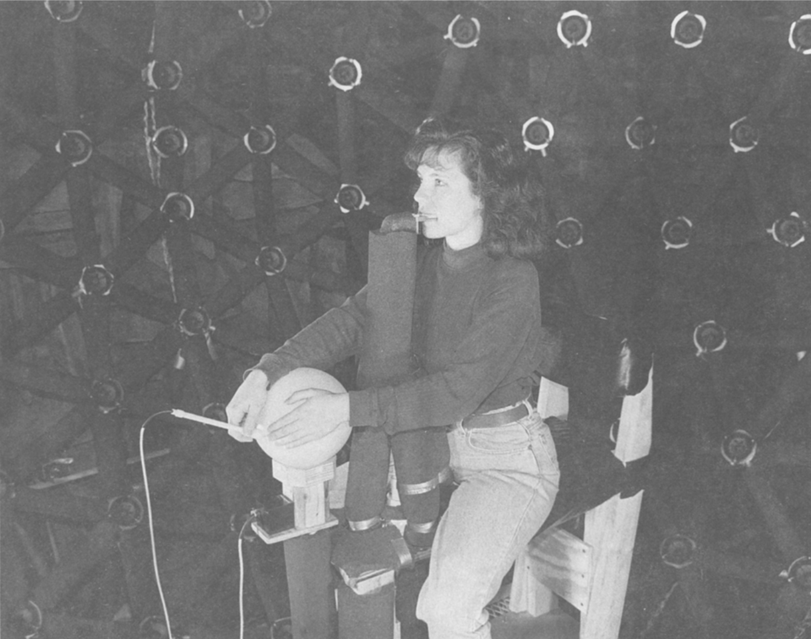

---
## Task definition
> The ability to identify the location of a sound source in a sound field. (Jutras et al., 2020)

### humans
- report verbally (Wightman and Kistler, 1992)
- nose pointing (Makous and Middlebrooks, 1990)
- God's eye (Gilkey et al., 1995)

### other mammals
- mostly MAA:
    - 2AFC

---
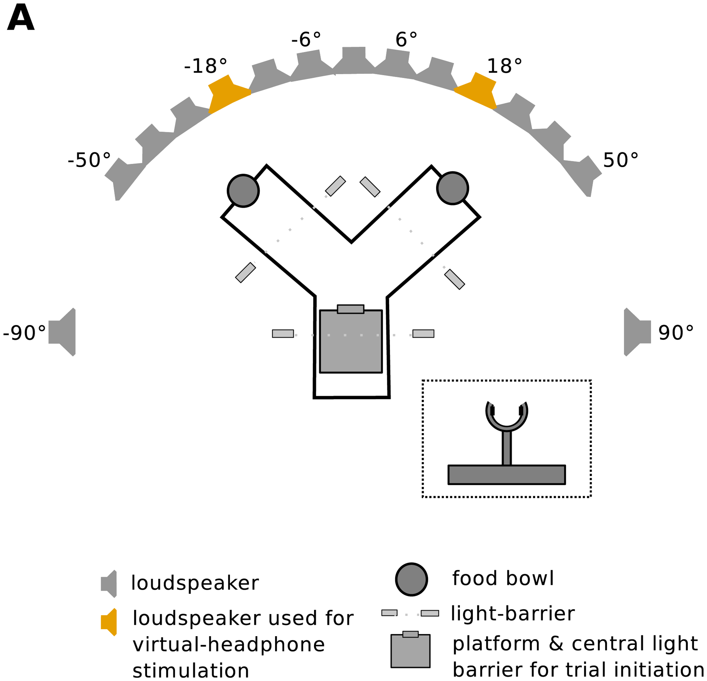
(Tolnai et al., 2017) - virtual headphones

---
## Task definition
> The ability to identify the location of a sound source in a sound field. (Jutras et al., 2020)

### humans
- report verbally (Wightman and Kistler, 1992)
- nose pointing (Makous and Middlebrooks, 1990)
- God's eye (Gilkey et al., 1995)

### other mammals
- mostly MAA:
    - 2AFC
- 6 AFC alternative for SNR

---
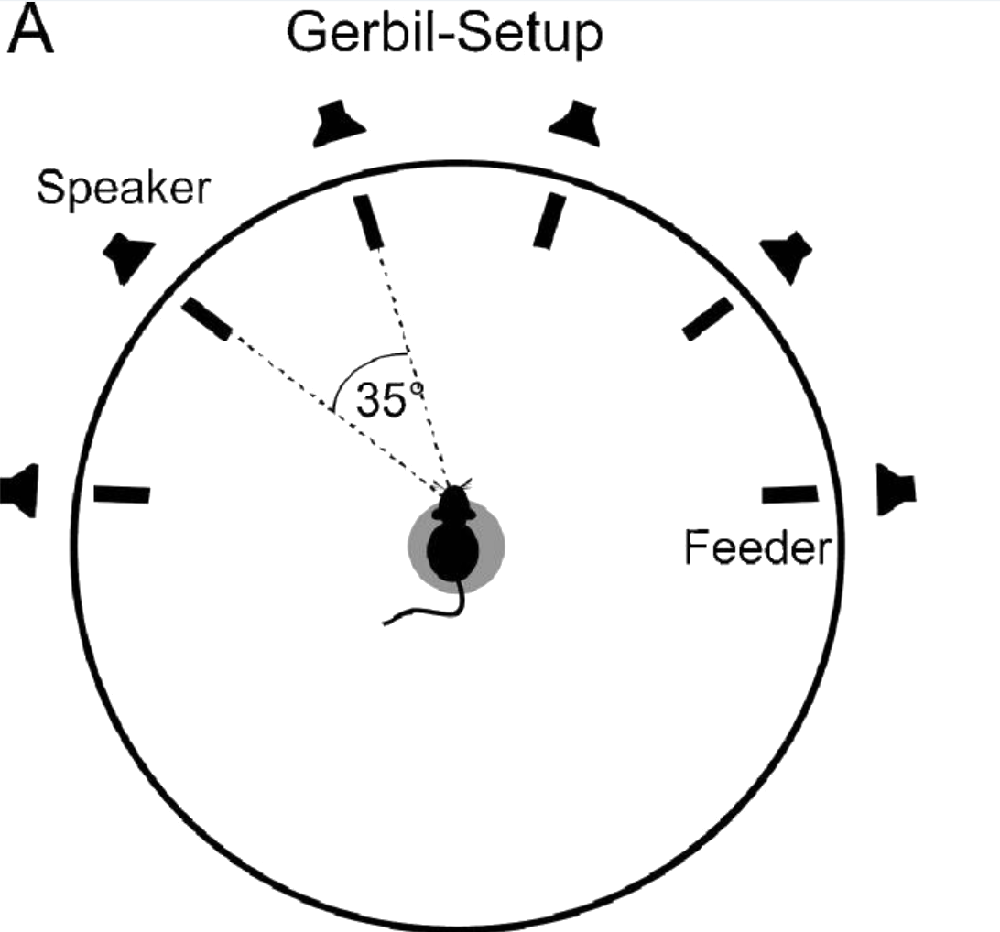
(Lingner et al., 2012) - sound localization SNR

---
## why it's interesting
  

1. point-like sensor to spatial
1. limited cues are enough to accomplish it
1. evolutionary perspective

---
## why it's interesting
1. point-like sensor to spatial -> consider vision and somatosensation
1. limited cues are enough to accomplish it
1. evolutionary perspective
---

## why it's interesting

1. point-like sensor to spatial -> consider vision and somatosensation
1. ### limited cues are enough to accomplish it
    - 3 classes of cues: ITD, ILD, spectral

---
 

(Grothe and Pecka, 2014)

---
## why it's interesting

1. point-like sensor to spatial -> consider vision and somatosensation
1. ### limited cues are enough to accomplish it
    - 3 classes of cues
    * spectral cues don't change in horizontal -> binaural
    * small ranges: ITD $\in [\pm 0.6 \micro s ]$, ILD $\in [\pm 50dB ]$
    * ITD viable in larger heads, ILD frequency dependent
        - ILD high freq affected most (Rayleigh, 1875)
        - for humans, viable >1.3 kHz 

---
TODO: HRTF!

---

## why it's interesting

1. point-like sensor to spatial -> consider vision and somatosensation
1. limited cues are enough to accomplish it
3. ### evolutionary perspective
    * independent evolution (Grothe and Pecka, 2014)

---
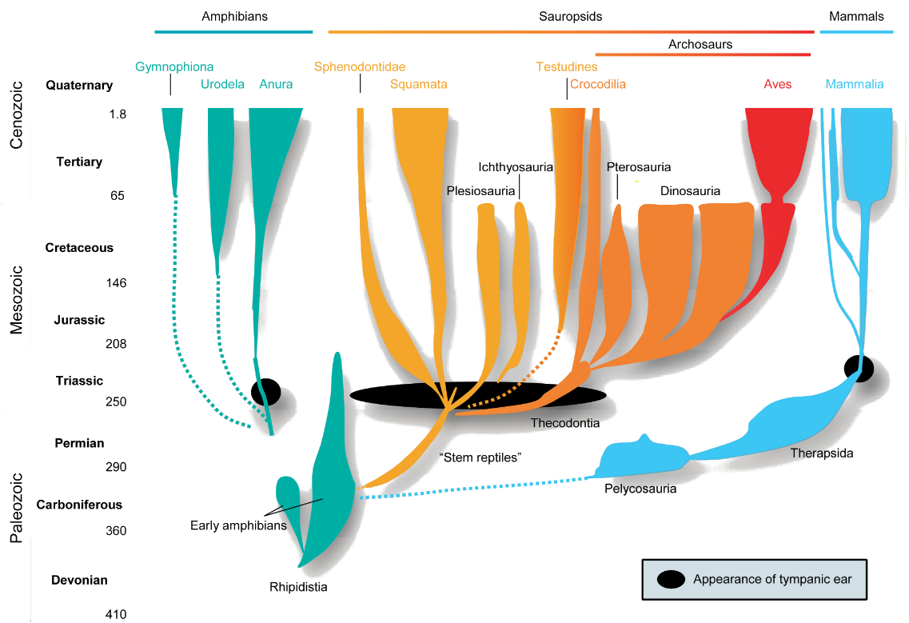
<!-- 
common evolutionary pressure is unclear for now
this also means possibly independent solutions! -->

---

## why it's interesting

1. point-like sensor to spatial -> consider vision and somatosensation
1. limited cues are enough to accomplish it
1. ### evolutionary perspective
    - independent evolution (Grothe and Pecka, 2014)
    - diets changed to seeds, depriving three ossicles of their function
    * only small, nocturnal mammals survived
    * mother-pup communication calls outside reptilian-bird hearing range

---

## basic concepts: review
 

1) ILD, ITD, spectral cues
1) HRTFs contain all of them
1) specialized anatomical and physiological properties not found anywhere else
1) parallel evolution means different mechanisms may be in use in different _classes_

---
# anatomy of hearing

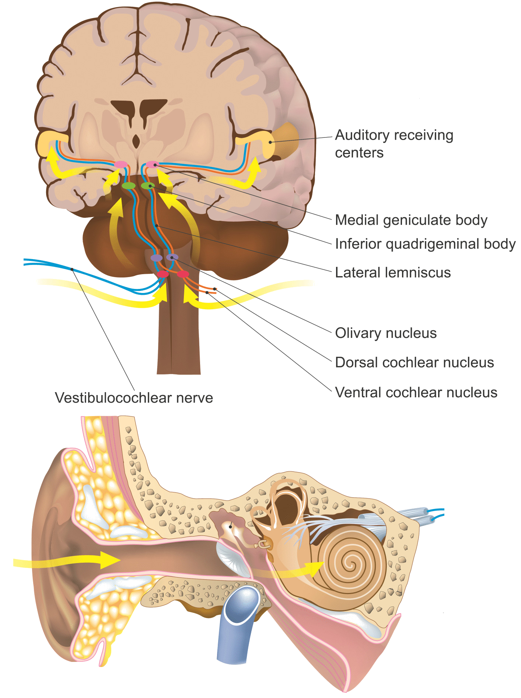

- auditory pathway overview
- desa working on anf to midbrain
- i decided to start with the inputs, so cochlea simulation
- stills taken from [CrashCourse](https://www.youtube.com/@crashcourse) and [wikipedia](https://en.wikipedia.org/wiki/Hair_cell)

---

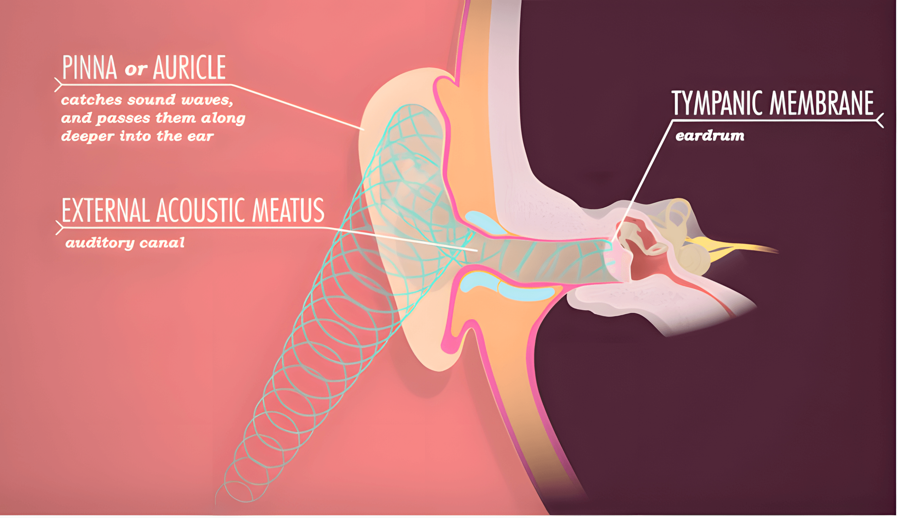
<!-- 
formed of three parts...
here's my opinion on the external ear, for our purposes.
the external ear has three basic functions:
1. channel sound waves inside the ear canal
2. characterize sound elevation
3. characterize front-back difference
-->
---

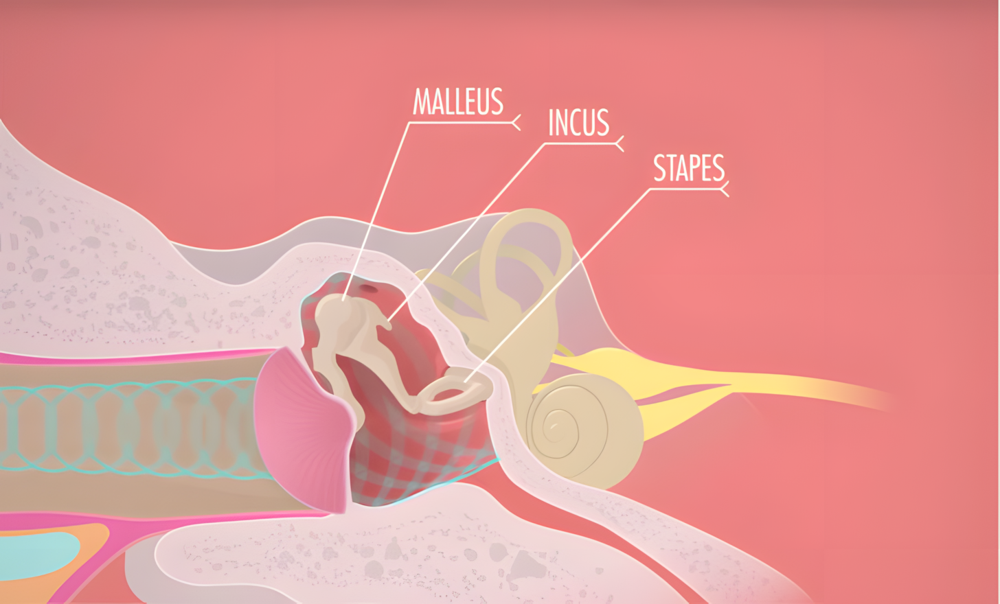
<!-- 
the middle ear is characterized by three ossicles...
it is also, interestingly, a closed chamber, can be opened by swallowing, blowing into your nose, chewing. an example is if you've ever been diving
we've seen the three ossicles before!
the stapes "knocks" on the oval window, against the labyrinth.
the amplification given by the ossicles is necessary because moving a sound through liquid, like in the labyrinth, is harder than through air.
-->
---
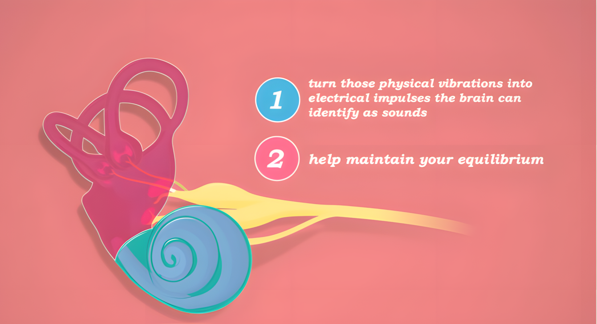

---
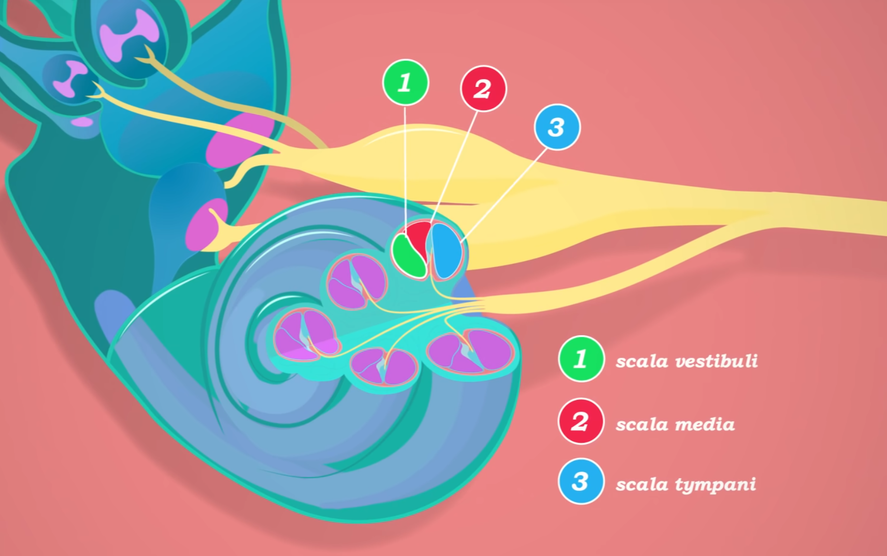

---
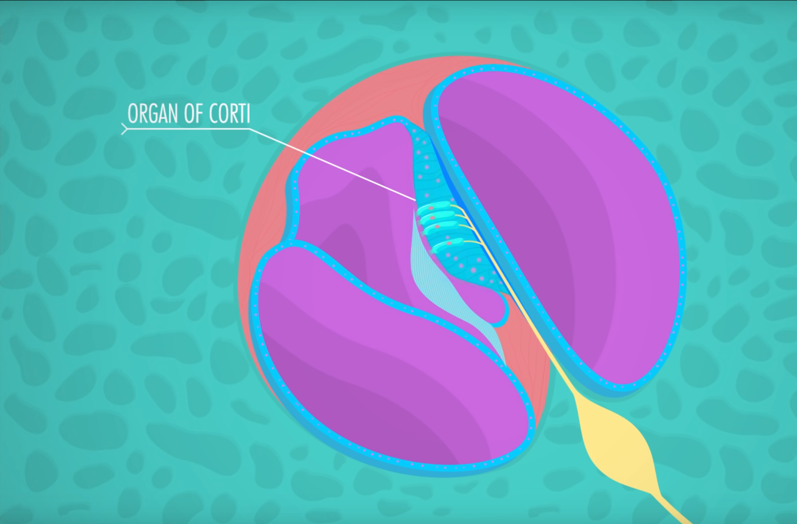
<!-- basilar membrane -->
---
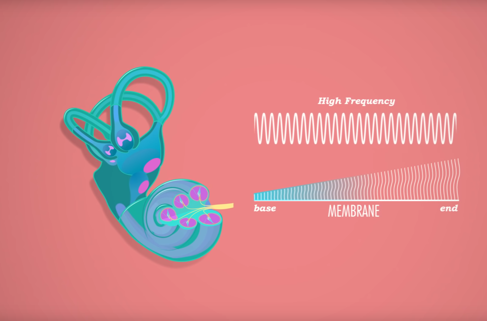
<!-- basilar membrane resonates tonotopically -->
---

---

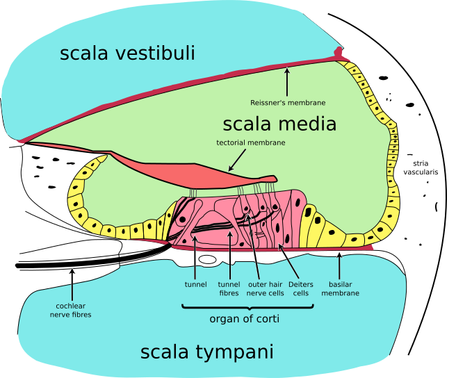
<!-- here's another image, from the side -->
---

<!-- you'll notice that there are two types of hair cells, outer hair cells and inner hair cells -->
---
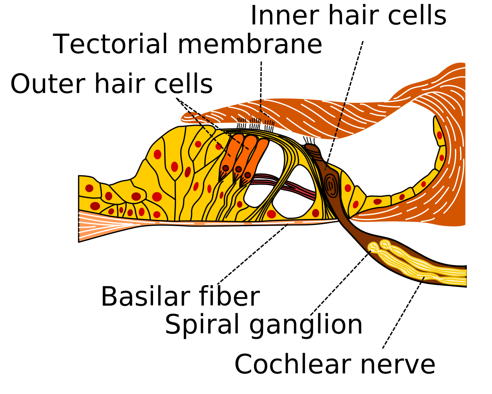

<!-- 
inner hair cells are very innervated, about 10 cochlear nerve fibers per hair cell, while outer hair cells are much less innervated, as one cochlear nerve fiber innervates multiple of them.
outer hair cells actually have a very specific function: they non-linearly compress the audible range about a million to a hundred
-->

---

<!-- the threshold is 0.1nm -> 0dB; loudest is 10nm -> 120dB -->

---
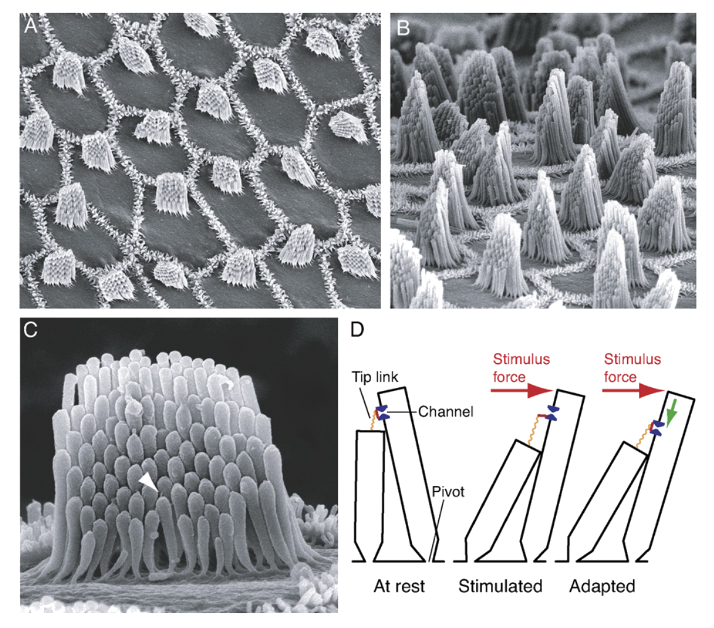
Sensory epithelium of the chicken cochlea:
- hexagonal array of short hair cells bordered supporting cells
- deflecting causes depolarization

(Hudspeth, 2008)

<!-- TODO mention phase locking as ihc move back and forth between hyper pol and depol -->

--- 

1. Deflection of the bundle bends the stereociliary pivots, tenses the tip link, and opens the transduction channel
2. $K^+$ and $Ca^{2+}$ enter the cytoplasm and depolarize the hair cell
3. $Ca^{2+}$ interacts with a molecular motor and slips down, lowering tension

(Hudspeth, 2008)

---
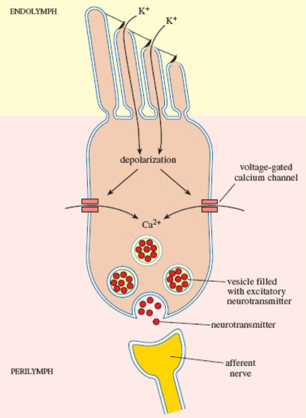
- although inner hair cells depolarize, they do not produce an action potential, but a _graded potential_
- the depolarization causes release of glutamate in ribbon synapse
- glutamate stimulates action potential in type I fibers

---

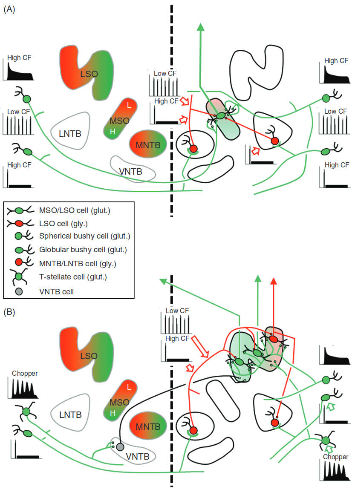

<!-- 
which then connect to a variety of different cell types and go on to reach the superior olivary complex, which is outside of our scope -->

---
# what are we doing? what am i doing?
- what is our role? validating a model

---

# simulation

3. simulation
    - nest and architecture
    - brian2-brian2hears
    - my implementation and workflow
4. conclusion
5. feature steps

---

# how do we code this?

---

<!-- _class: -->